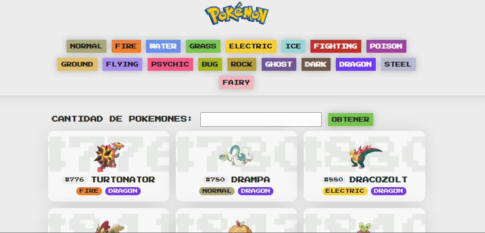
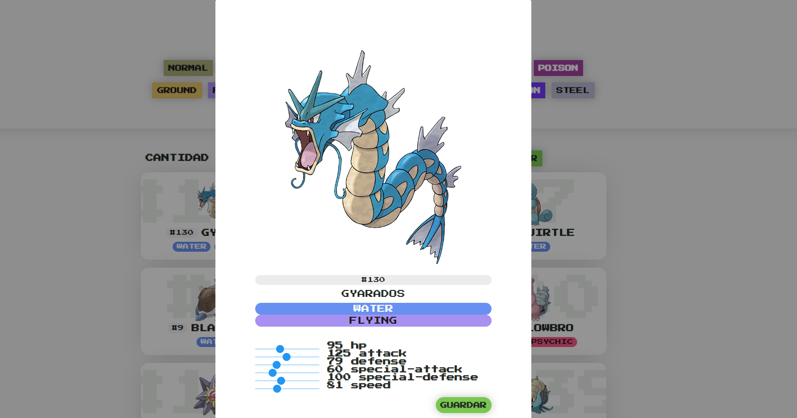

# Proyecto Pokémon

Este proyecto consiste en una aplicación web que permite explorar y obtener información sobre diferentes Pokémon según su tipo. A continuación, se detalla la estructura y funcionalidades principales del proyecto.

## Contenido del Repositorio

- `index.html`: Archivo principal que contiene la estructura HTML de la aplicación.
- `style.css`: Archivo de estilos que define el diseño y la apariencia de la aplicación.
- `main.js`: Archivo JavaScript que proporciona la funcionalidad interactiva de la aplicación.

## Estructura del Proyecto

El proyecto se compone de tres archivos principales:

### `index.html`

Este archivo define la estructura de la página web y contiene los elementos HTML necesarios para la navegación y visualización de los Pokémon. A continuación, se describen los elementos principales:

- **Encabezado (Header):** Contiene el logo de la Pokédex y una lista de botones de navegación según los tipos de Pokémon.

- **Formulario de Cantidad de Pokémon:**
  - Permite al usuario especificar la cantidad de Pokémon que desea visualizar.
  - Al presionar el botón "Obtener", se carga la información correspondiente.

- **Sección Principal (Main):**
  - Contiene un contenedor donde se muestran los Pokémon obtenidos.

### `style.css`

Este archivo contiene las reglas de estilo que determinan el diseño y la apariencia de la aplicación. Algunos aspectos destacados incluyen:

- Paleta de colores y estilos para diferentes tipos de Pokémon.
- Diseño de los botones de navegación y formulario.
- Disposición de los elementos en la página para diferentes tamaños de pantalla.

### `main.js`

Este archivo contiene el código JavaScript que proporciona la funcionalidad interactiva de la aplicación. Aquí se encuentran las siguientes funciones y características:

- Conexión a una API que proporciona datos de Pokémon.
- Obtención y visualización de los Pokémon según la cantidad especificada.
- Interacción con los Pokémon para mostrar detalles y habilidades.
- Edición y guardado de estadísticas de los Pokémon.

## Configuración y Uso

1. Clona o descarga el repositorio en tu máquina local.
2. Abre el archivo `index.html` en un navegador web.
3. Utiliza los botones de navegación para explorar Pokémon por tipo.
4. Completa el formulario para obtener una cantidad específica de Pokémon.
5. Haz clic en un Pokémon para ver sus detalles y habilidades.

¡Disfruta explorando el mundo de Pokémon!

---

**Nota:** Este proyecto utiliza recursos externos, como la API de Pokémon, la herramienta de MOCKAPI y las bibliotecas de estilos y alertas de SweetAlert. Asegúrate de tener una conexión a Internet activa para un funcionamiento óptimo.